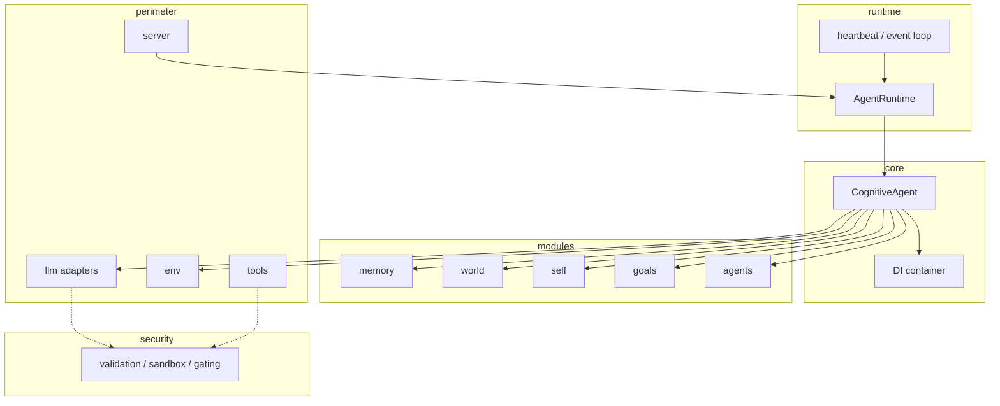
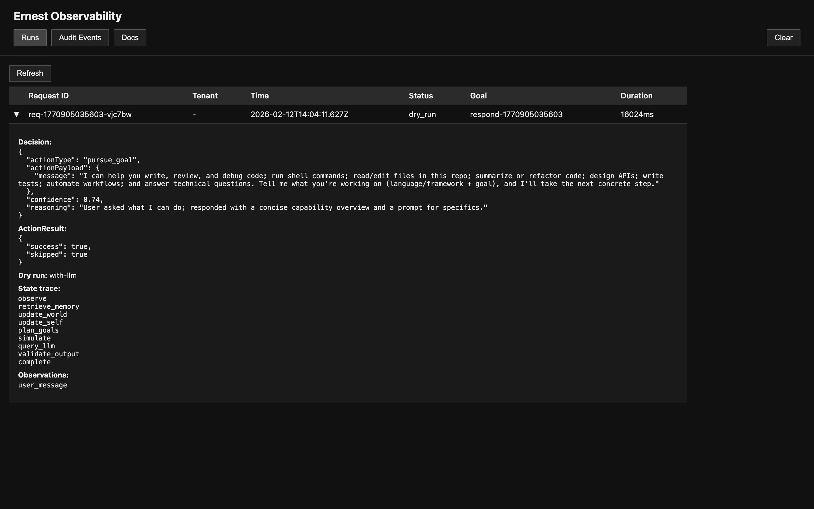
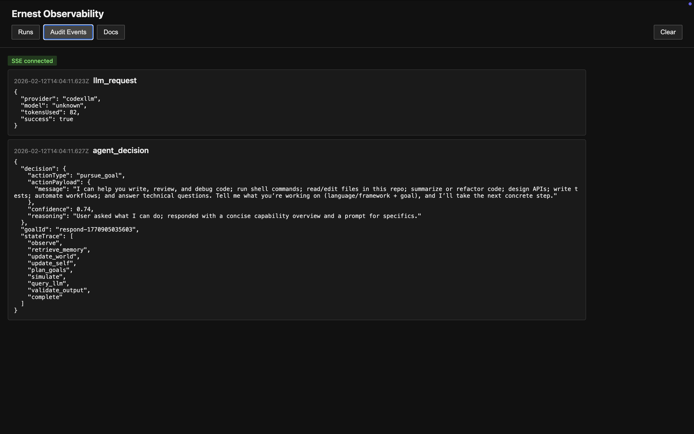
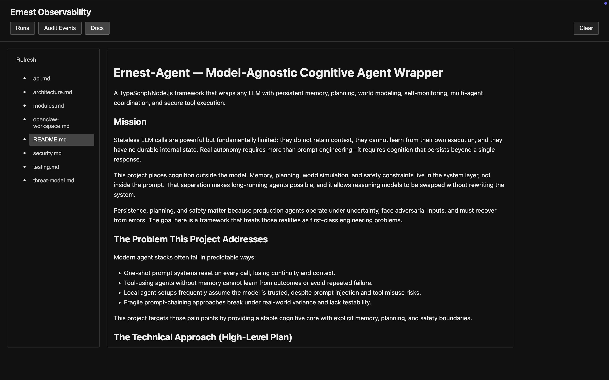
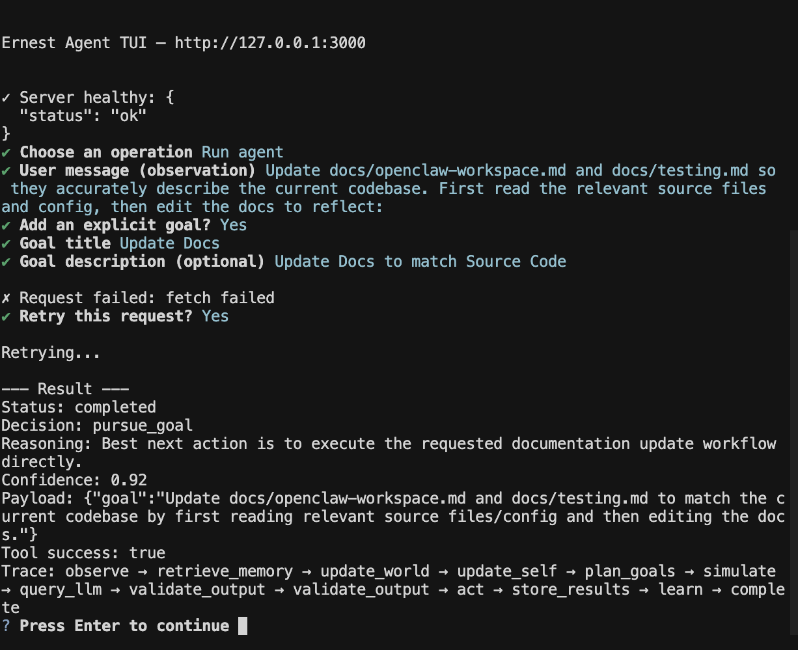

# Ernest-Agent — Model-Agnostic Cognitive Agent Wrapper

A TypeScript/Node.js framework that wraps any LLM with persistent memory, planning, world modeling, self-monitoring, multi-agent coordination, and secure tool execution.

## Mission

Stateless LLM calls are powerful but fundamentally limited: they do not retain context, they cannot learn from their own execution, and they have no durable internal state. Real autonomy requires more than prompt engineering—it requires cognition that persists beyond a single response.

This project places cognition outside the model. Memory, planning, world simulation, and safety constraints live in the system layer, not inside the prompt. That separation makes long-running agents possible, and it allows reasoning models to be swapped without rewriting the system.

Persistence, planning, and safety matter because production agents operate under uncertainty, face adversarial inputs, and must recover from errors. The goal here is a framework that treats those realities as first-class engineering problems.

## The Problem This Project Addresses

Modern agent stacks often fail in predictable ways:

- One-shot prompt systems reset on every call, losing continuity and context.
- Tool-using agents without memory cannot learn from outcomes or avoid repeated failure.
- Local agent setups frequently assume the model is trusted, despite prompt injection and tool misuse risks.
- Fragile prompt-chaining approaches break under real-world variance and lack testability.

This project targets those pain points by providing a stable cognitive core with explicit memory, planning, and safety boundaries.

## The Technical Approach (High-Level Plan)

The system is structured as a layered architecture with strict boundaries:

- **Model-agnostic LLM adapters**: a common interface for OpenAI, Anthropic, and local models.
- **Persistent memory**: episodic, semantic, and procedural memories with embedding-based retrieval, time decay, and goal relevance scoring.
- **World modeling**: a world state schema with rule-based predictors and uncertainty tracking for action simulation.
- **Self-modeling**: capability and reliability tracking that updates based on execution outcomes.
- **Goal planning**: a hierarchical goal stack and planner that uses simulation to select actions.
- **Multi-agent coordination**: an agent registry and message bus with explicit memory boundary controls.
- **Secure execution boundaries**: prompt injection filtering, output validation, tool permission gating, and sandboxed tool execution.
- **Runtime / Autonomy**: heartbeat-driven orchestration, event triggers, per-tenant budgets (max runs/hour, max tokens/day), circuit breaker with cooldown, kill switch, and structured audit logging. Text-only observation pipeline with input size caps and safe object validation.

The LLM is a replaceable inference engine; cognition and safety are system responsibilities.

## How It Works

Each agent run follows a fixed pipeline: **observation → memory retrieval → planning → LLM query → validation → tools → storage**.

1. **Observation** – The environment (e.g., OpenClaw workspace, request state) supplies current state. Observation adapters provide text-based inputs; a normalizer applies size caps and safe object validation.
2. **Memory retrieval** – Episodic, semantic, and procedural memories are fetched for the current goals. Embedding-based retrieval uses goal relevance and time decay.
3. **Planning** – The goal stack and planner produce candidate actions. The world and self models are used to simulate outcomes before choosing.
4. **LLM query** – The chosen prompt is sent to the LLM adapter (API or CLI). The model returns a proposed decision (action type, payload, confidence).
5. **Validation** – Output is schema-validated. Malformed or unexpected responses are rejected before any action.
6. **Tools** – Validated actions map to tools in the registry. Execution is permission-gated and sandboxed (worker threads, timeout, abort, SIGTERM→SIGKILL).
7. **Storage** – Episodic memory is updated with the outcome; self-model and goal status are refreshed.

Dry-run modes (`with-llm` / `without-llm`) skip act and storage. When `autoRespond` is enabled and a `user_message` exists without an explicit goal, the server injects a default "Respond to user" goal; otherwise the agent returns idle.

## Architecture at a Glance

The framework uses a layered architecture where cognition lives in the system layer. The LLM adapter is a swappable component at the perimeter, not the core.



## Model Adapters

Adapters implement a common `LLMAdapter` interface and fall into two categories:

**API-based adapters** (OpenAI, Anthropic, Local): Use API keys and HTTP. Suitable for programmatic usage and server deployment.

**CLI-based adapters** (Codex CLI, Claude Code CLI): Run locally installed CLI tools (`codex`, `claude`) and rely on the user's existing subscription login. No separate API key required. The agent invokes these via tools such as `invoke_codex` and `invoke_claude`. Prompts are passed via temp files or stdin; never via process argv (avoids prompt leakage in process listings). Temp files use `0o600` permissions. Use API adapters when you need strict isolation, controlled rate limits, or server-side deployment without local CLIs. See [tools/README.md](tools/README.md) for setup.

## Observability UI

When `OBS_UI_ENABLED=true` (default in dev), a local dashboard is served at `/ui`. Tabs: Runs (recent completions), Audit Events (SSE stream), Docs (markdown viewer).







Local-only by default: the server binds to localhost unless configured otherwise. When `API_KEY` is set, `/ui` routes require authentication unless `OBS_UI_SKIP_AUTH=true` (which forces the server to bind to localhost). SSE events include `run_complete` for live run updates. Markdown is sanitized before rendering. `/ui/clear` requires `OBS_UI_ALLOW_CLEAR=true` or non-production `NODE_ENV`. See [docs/api.md](docs/api.md) for endpoints and env vars.

## Why This Is Built as a Wrapper (Not a Model)

This project intentionally avoids training or hosting its own foundation model. Cognition should not be conflated with inference. By keeping memory, planning, and safety outside the model, the system remains testable, auditable, and swappable.

This separation allows model upgrades or vendor switches without re-architecting the agent logic. It also prevents model-specific quirks from becoming hidden dependencies.

## Security Philosophy

Local and remote LLMs are treated as untrusted. Prompt injection, tool misuse, and output manipulation are expected risks—not edge cases.

Security is enforced through least privilege and explicit validation:

- Prompt injection filtering before the model sees inputs.
- Schema validation for model outputs before any action is executed.
- Tool allowlists and sandboxed execution paths.
- Memory poisoning detection to prevent long-term contamination.
- SSRF and path traversal protections in external interfaces.

The system is secure by default and assumes adversarial inputs.

## Security and Trust Model (Summary)

- **Untrusted LLMs**: Local and remote models are treated as untrusted; outputs are validated before execution.
- **Prompt injection**: Filtering and sanitization before inputs reach the model.
- **Tool sandbox**: Tools run in worker threads with timeout, abort, and SIGTERM/SIGKILL escalation.
- **Output validation**: Strict schema validation before any action executes.
- **Path traversal and SSRF**: Protections for file access and outbound requests.
- **Audit logging**: Structured logs for LLM requests, agent decisions, and errors.
- **Rate limiting**: Per-tenant and API-level limits to mitigate abuse.

See [docs/security.md](docs/security.md) for details.

## Testing

```bash
npm test
npm run lint
```

Tests use Jest with a 90% coverage target (branches, functions, lines, statements). New functionality is expected to include tests (TDD). See [docs/testing.md](docs/testing.md) for categories, coverage expectations, and how to add tests.

Request testing: Use `autoRespond: true` or `AUTO_RESPOND=true` to exercise auto-respond (default "Respond to user" goal when user_message exists without explicit goal). Default behavior remains idle unless auto-respond is explicitly enabled.

## Quick Start

Run the terminal UI to interact with the agent (`npm run ernest-agent` with the server running):



See [QUICKSTART.md](QUICKSTART.md) for install, build, run, and curl commands.

## Docs Index

- [QUICKSTART.md](QUICKSTART.md) – Install, run, and curl the server
- [docs/architecture.md](docs/architecture.md) – Layered architecture, module roles, control loop, runtime, design invariants
- [docs/security.md](docs/security.md) – Trust boundaries, controls, CLI caveats, observability UI security
- [docs/threat-model.md](docs/threat-model.md) – Assets, adversaries, threats and mitigations
- [docs/testing.md](docs/testing.md) – Test workflow, coverage, conventions
- [docs/openclaw-workspace.md](docs/openclaw-workspace.md) – OpenClaw workspace support (AGENTS, SOUL, TOOLS, skills)
- [docs/api.md](docs/api.md) – HTTP API reference (health, run-once, dryRun, observability UI)

## Project Status & Roadmap

**Current maturity:** early but functional. The architecture is in place with a full test suite and core modules implemented.

**Implemented:**

- Core cognition loop with state-machine phases
- LLM adapters (OpenAI, Anthropic, local) + mock adapter
- Persistent memory with retrieval scoring and vector store abstraction
- World model with rule-based predictors and uncertainty
- Self-modeling and reliability tracking
- Goal stack and heuristic planner
- Multi-agent registry and message bus
- Security layer (validation, sandboxing, gating, SSRF/path protections)
- Fastify API for one-shot agent execution
- **Runtime**: `AgentRuntime` with heartbeat, `emitEvent()`, budget guardrails, circuit breaker, kill switch; `ObservationAdapter` and `ObservationNormalizer` for text-only observations
- **CLI tools**: `invoke_codex` and `invoke_claude` for running Codex and Claude Code from the terminal using your existing subscriptions ([tools/README.md](tools/README.md))
- **Dry run**: `dryRun: 'with-llm'` or `'without-llm'` to preview decisions without executing tools or updating state
- **Auto-respond**: When `AUTO_RESPOND=true` (env) or `autoRespond: true` (request body), the server injects a default "Respond to user" goal when a `user_message` exists and no explicit goal is provided. Disabled by default; the agent remains idle unless auto-respond is explicitly enabled.
- **Observability UI**: Local dashboard at `/ui` when `OBS_UI_ENABLED=true` (default in dev). Tabs for Runs, Audit Events (SSE), and Docs/Markdown viewer. Uses `marked` and `dompurify` for safe markdown rendering. Binds to localhost by default when enabled.

**Planned / next milestones:**

1. Hardened environment tool registry with granular policies
2. Expanded vector backend support and indexing options
3. More advanced planning strategies and long-horizon optimization
4. Additional integration tests and adversarial test suites

Development is iterative and test-driven; no unsafe “quick demos” are prioritized over correctness.

## Who Is Behind This Project

I’m Cory Bethrant. I’ve worked as a CTO and software engineer building production systems in fintech, infrastructure, and security-sensitive environments. My focus has consistently been on reliability, safety, and operational rigor—shipping systems that keep working when conditions are noisy and adversarial.

This project is motivated by the gap between impressive model demos and the hard engineering required to build durable agent systems. I’m building it incrementally, with tests and security constraints first, because that’s the only way to make it trustworthy.

## Who This Project Is For (and Who It Isn’t)

**For:**

- Engineers building reliable agent systems
- AI researchers and applied practitioners
- Security engineers evaluating agent risks
- Contributors who care about testing, architecture, and safety

**Not for:**

- Consumer chatbot experiences
- Toy demos or prompt-only prototypes
- AGI claims or speculative narratives

## Contributing

Contributions are welcome and expected to be thoughtful and test-backed.

- Engineering contributions: features, bug fixes, performance, integration work
- Security review: threat modeling, adversarial testing, policy improvements
- Research input: evaluation of planning and memory strategies

Please open issues for design discussions and submit PRs with tests when possible.

## Using and Sharing the Project

If you experiment with this framework, share what you learn—especially failure modes and mitigation strategies. Responsible sharing and transparent evaluation are more valuable than hype. Feedback and collaboration are strongly encouraged.
