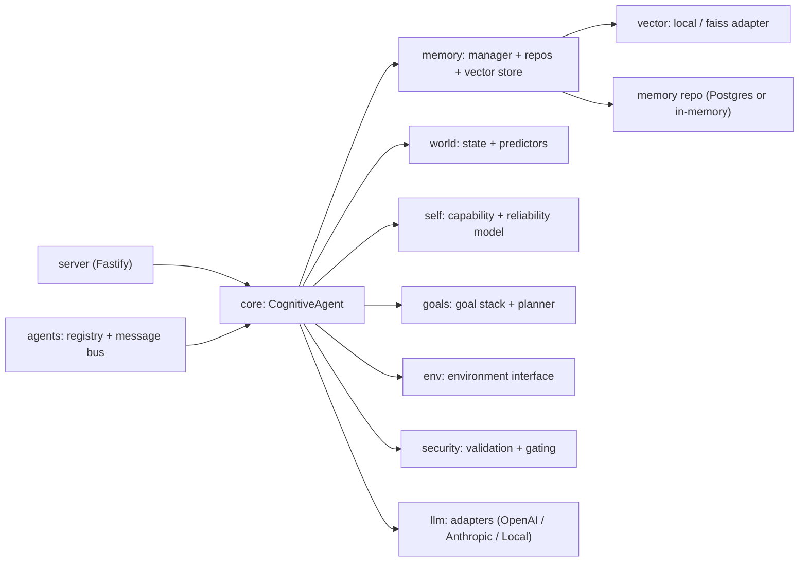

# Architecture Overview

The Cognitive Agent Wrapper separates cognition from model inference, storage, and execution. The LLM is a replaceable component behind a strict adapter interface.

The control loop follows a state machine: observe, retrieve memory, update world, update self, plan, simulate, query LLM, validate, act, store results, learn.
