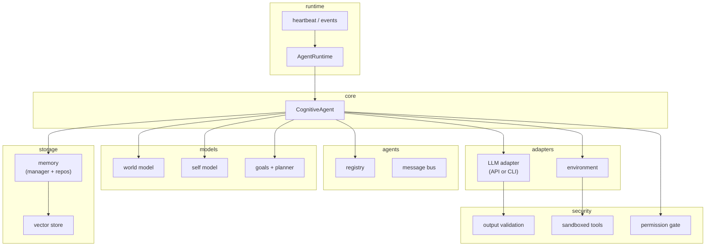

# Architecture

## Overview

The Ernest agent framework uses a layered architecture where cognition lives outside the model. Memory, planning, world simulation, self-modeling, and goal selection are implemented in the system layer. The LLM is an inference engine behind a strict adapter interface; it can be replaced without changing the cognitive logic.

This separation enables:

- Model upgrades and vendor changes without re-architecting the agent
- Testability through mock adapters and deterministic components
- Consistent safety and validation regardless of which model is used

## Module Responsibilities

| Module | Responsibility |
|--------|----------------|
| `core` | Cognition loop (CognitiveAgent), dependency injection, shared contracts (LLM, agent, security interfaces) |
| `memory` | Episodic, semantic, procedural memory; repositories (in-memory, Postgres); vector store abstraction; retrieval scoring |
| `world` | World state schema, rule-based predictors, uncertainty tracking, simulation |
| `self` | Capability and reliability tracking, updated from execution outcomes |
| `goals` | Goal stack, hierarchy, priorities; planner with simulation-based action selection |
| `agents` | Multi-agent registry, message bus, role specialization, memory boundary controls |
| `llm` | Model adapters implementing `LLMAdapter` (OpenAI, Anthropic, Local, Codex CLI, Claude Code CLI, Mock) |
| `env` | Environment interface for observation and action; mocks for testing |
| `security` | Prompt injection filtering, output validation, permission gating, sandboxed tools, rate limits, SSRF/path protections, audit logging |
| `server` | Fastify API, request orchestration, container wiring |
| `runtime` | AgentRuntime with heartbeat, event queue, event triggers, per-tenant budgets (max runs/hour, tokens/day), circuit breaker with cooldown, kill switch; ObservationAdapter and ObservationNormalizer for text-only observations |
| `tools` | Module-based tool registry; invoke_codex, invoke_claude for CLI-based inference; sandboxed execution in worker threads |

## Control Loop

The agent executes a state machine on each run:

1. **observe** – Read observation from the environment
2. **retrieve_memory** – Fetch relevant memories (episodic, semantic, procedural) for the current goals
3. **update_world** – Update world state from observation
4. **update_self** – Refresh self-model snapshot (capabilities, reliability)
5. **plan_goals** – Resolve next goal from the stack; planner produces candidate actions
6. **simulate** – Evaluate candidate actions using world and self models
7. **query_llm** – Send prompt to LLM adapter; receive proposed decision
8. **validate** – Schema-validate LLM output before execution
9. **act** – Execute action via environment (with permission gating)
10. **store** – Persist episodic memory of the outcome
11. **learn** – Update self-model and goal status from outcome

The loop may exit early on error, idle (no goal), completion, or dry run.

### Runtime Overview

`AgentRuntime` orchestrates runs via a heartbeat and an event queue. Tenants are processed serially per tenant. Per-tenant budgets (max runs/hour, max tokens/day) block runs when exceeded. A circuit breaker opens on consecutive failures and blocks further runs until cooldown. A kill switch stops the runtime immediately. Run timeouts trigger abort and SIGTERM→SIGKILL escalation.

### Observation Pipeline

`ObservationAdapter` implementations yield text-based observations for the agent. `ObservationNormalizer` produces `StateObservation` from raw inputs with configurable size caps and safe object validation. Only text-safe, structured values are passed into the cognitive loop; non-serializable or unsafe objects are rejected.

### Tool Execution

Tools are registered in a module-based registry. Handlers are looked up by name; no `eval` or dynamic code execution. Execution runs in worker threads with timeout, abort signal, SIGTERM→SIGKILL escalation, and process group termination (Unix) so forked children are killed with the parent. All tool inputs are validated for structured-clone compatibility before being sent to workers.

**Dry run modes** (when `dryRun` is set): Skip act, memory, and self-model updates. Two variants:
- `with-llm`: Full loop including LLM call; returns decision without executing tools. Useful to preview what the model would do (e.g., with Codex).
- `without-llm`: Skips LLM call; uses first candidate action as stub decision. No API cost; useful for pipeline testing.

## Architecture Diagram

The LLM adapter is at the perimeter. Core cognition does not depend on a specific model.

## Design Invariants

- **Core cannot import LLM or HTTP**: The cognitive agent depends on interfaces only. Network and model-specific code stay in adapters.
- **Model-agnostic**: Cognition logic does not assume model behavior. All model output is validated.
- **Dependency injection required**: Components are wired via a container. No global singletons for core services.
- **Tool execution gated**: Actions must pass permission checks before execution. Tools run in sandboxed workers.
- **Strict output validation**: LLM responses are schema-validated before any side effect.
- **Local LLMs untrusted**: Local models receive the same validation and sandbox treatment as remote APIs.

## Observability

When `OBS_UI_ENABLED`, the server exposes an in-memory observability store. Runs and audit events are held in ring buffers (default 100 runs, 500 events). Not durable: data is lost on restart. Intended for development and local inspection. The `/ui` dashboard provides Runs, Audit Events (SSE), and a Docs (markdown) viewer.
